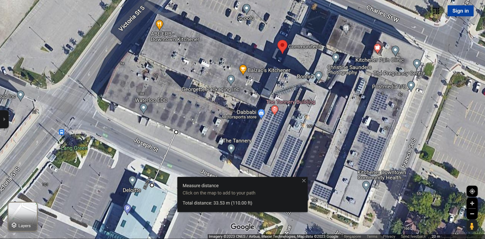

<div align="center">
  
  **[:arrow_left: Previous Section][Prev] | [Table of Contents][TOC] | [Next Section :arrow_right:][Next]**
  
  [Prev]: ./01-02.md
  [Next]: ./03-00.md
  [TOC]: ./README.md#table-of-contents
  
</div>

---

## 2. Systemic Connectivity from The Province's Regions to Municipalities 

Let's excavate the inner-workings of the lush microcosm for gray-area (shady business) activities in Kitchener-Waterloo Region.

Federal money routed via 'luminary' organizations like Waterloo EDC in Ontario, go to entities like Communitech via persons like Jay Shah. This is where resident taste-testers in units like Deloitte's DSpace, identify the purity and quality of the prepackaged money, that is regularly dropped off at their "BufferZone."

[DSpace](https://www2.deloitte.com/ca/en/pages/technology/articles/creative-collision-with-communitech.html) is located inside Communitech, that is, in the Tannery Building. DSpace is one of the most ingenious, deep blue-sky projects that Deloitte could have ever green-lit, in its entire history of existence. What exactly is DSpace and what do its members do? Putting the empty catch phrases and marketing buzzwords that describe it aside, its ingeniousness resides in how: 

- **Deloitte's exclusive interns and employees, posted in what would otherwise be a team or a department in a local Deloitte office, are designated as 'at-arms-length, external consultants' to the Deloitte firm, working out of DSpace in Communitech's building.** 

</br>

The above strategy, according to Deloitte's leadership and portfolio management gurus, is a mere artifact of their internal human-resource management practices. Let's inspect things a bit more closely, to better understand the magic and wizardry of the speak-easy called Communitech-DSpace, which involves the following framing window and viewing angle for their industry regulators:

- Deloitte employees musing out loud while sitting in Communitech's green zone, which were literally demarcated by green carpets within the Communitech building, get to charge an invoice and a bill to Deloitte, whereby,  

    - Deloitte charges that amount to one of their clients' accounts to then receive income from that client,  

    - But that income before taxes and depreciation, smoothly gets labeled as an expense to "external consultants" working out of DSpace. 

- Essentially, Deloitte's managers have created a loophole using DSpace in Communitech through which, they are able to consult with themselves for themselves, and then charge a client for the hours spent thinking out loud among Deloitte employees, on "futuristic" projects, or on ideas that aren't necessarily related to any conceivable client's requirements. 

- The more facile and magical aspects of the patch of velvet carpet, rented out to DSpace by Communitech, has to do with its open and immediate proximity to other government bodies like the Liquor Control Board of Ontario (LCBO), as well as to publicly traded companies like ManuLife insurance corporation, and TD Bank. All such corporate tenants of Communitech have their co-located patches of carpet, right next to each other. Any data or intel thus "peaked at", by neighboring actors performing out of the deregulated staging area provided by Communitech, or overheard during backstage conversations next to water-coolers, is labeled as "open-sourced-intelligence."

Of Course, KPMG, Deloitte Group, EY, and PWC get to self-regulate themselves, with impunity. They are their own, regulatory authorities. And the [LCBO](https://en.wikipedia.org/wiki/Liquor_Control_Board_of_Ontario) is a regulatory government entity within Ontario's Finance Ministry that is funded by tax-payer money. As such, DSpace is an illusion created within Ontario Government's version of the Magic Castle called Communitech (with free-flowing craft-beer and other libations), to demonstrate and showcase their highly evolved skills within their craft of economic development; but mostly to their local peers, special interest groups, and international clientele. 

<div align="center">
 
 
 <p><a href="https://www.google.com/maps/place//@43.4512252,-80.4996629,18z">https://www.google.com/maps/place//@43.4512252,-80.4996629,18z</a> 
</div>

Deloitte's actual office in Kitchener, is located approximately 110 feet away from Communitech's building, and yet, DSpace is a separate consulting unit, "at arm's length" from Deloitte's main operations, even though they all happen to convene daily at the eateries and common areas, adjoining Communitech. 

Oh yes, Communitech is indeed located in a place called "Area 51", where Google's ATAP used to have some of their mavericks and geniuses work out of.

Before we go to the next topic, I'd like to say the following, which might sound obscure, but it might be important information for a particular type of individual who may read this, just in case I don't get to convey it to them at any other stage of life: 

> "Persons who have gravitas and those who are bound to matters of serious gravity, simply cannot, unwittingly attain, nor be cunningly thrust into, zero-G."

---

```
Abbreviations:
ATAP       - Advanced Technologies and Projects (Google)
EDC, EDCs  - Economic Development Corporation(s) 
EY         - Ernst & Young Global Limited
GTA        - Greater Toronto Area (Ontario, Canada)
KPMG       - Klynveld Peat Marwick Goerdeler, International Limited 
LCBO       - Liquor Control Board of Ontario
PWC        - Pricewaterhouse Coopers International Limited 
UWaterloo  - University of Waterloo
```

---
<div align="center">
  
  **[:arrow_left: Previous Section][Prev] | [Top :arrow_up:][Top] | [Next Section :arrow_right:][Next]** 
  
  **[Table of Contents][TOC]**

  [Prev]: ./01-02.md
  [Top]: ./02-00.md#2-systemic-connectivity-from-the-provinces-regions-to-municipalities
  [Next]: ./03-00.md
  [TOC]: ./README.md#table-of-contents
  
</div>