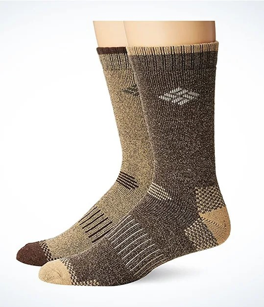

<div align="center">
  
  **[:arrow_left: Previous Section][Prev] | [Table of Contents][TOC] | [Next Section :arrow_right:][Next]**
  
  [Prev]: ./05-08.md
  [Next]: ./05-10.md
  [TOC]: ./README.md#table-of-contents
  
</div>

---

## 5.9 Not to Prince Edward

<div align="center">
  </img>
  <br>      
  <b>Nice pair of socks available. <br>Best for hiking!</b>
</div>

<br>

Well, let's see… hmm. 

Alright! 

So, first off, when someone expresses their dietary needs or preferences, please don't use slide-of-hand to force your preference onto them. Actually, just stop using slide-of-hand and other such trickery forever, even though such things have become second nature to you. 

Also, phrases like, "We've got to protect this house!" are only used for molding a particular type of mindset in programmed individuals, for whom those kinds of phrases become a trigger towards predetermined actions. Strongly suggesting those kinds of phrases to MBET students using your training's techniques, in a classroom setting, can become problematic. For those are the kinds of triggers, that aren't merely used for motivating people to become sh<i>i</i>ft distributors. 

The techniques you've become accustomed to, can even be used to cause a person to drift, or alternatively, prevent it, by aiding the person attain some groundedness. But, you have known such things all too well, and have been an expert in neuro-linguistic programming since the days of way back; from way back when fancy words like neuro-linguistics didn't even exist. Haven't you?

As you can see, I don't have any carrots with me. I'm also not interested in catching flies or dung beetles, so no honey or b s either. 

It is a rather problematic issue, and quite the cause for concern: ~~if~~ the Canadian government has been deliberately appointing certain staff and faculty as 'evangelists' within its institutions, to mold gullible and impressionable minds towards radical activities; particularly minds of international students that it lures and traps via those institutions.

The solitary reapers of the seas would have continued to be respectful of changing tides. Are you able to observe the changing tides, dear Edward? 

So, you might realize why <b>this haus</b>, which has been overrun by uncaring and carefree people, needs to be reset and put into a more suitable order for caring people. Or, alternatively, it just needs to be razed to the ground, so that something proper and legitimate can be built in its place, by an adjudicating and righteous set of hands, when its ashes have been wafted into the Arctic Ocean by a gentle breeze.

My guess is, Canada may want to help the province choose some other peaceful alternative towards the middle-grounds, in order to retain some necessary cheerfulness, and light-hearted carefreeness, within the remedied designs of its organizations, instead of the readily available and accessible alternatives at my disposal.

Let's see what kind of a shape that middle-ground takes, if Canada is to stay clear of molten diamonds raining upon its steps, from the heavenly skies.

---

```
Abbreviations:
MBET - Master's of Business Entrepreneurship and Technology (A graduate study program at the University of Waterloo)
```

---
<div align="center">
  
  **[:arrow_left: Previous Section][Prev] | [Top :arrow_up:][Top] | [Next Section :arrow_right:][Next]** 
  
  **[Table of Contents][TOC]**

  [Prev]: ./05-08.md
  [Top]: ./05-09.md#59-not-to-prince-edward
  [Next]: ./05-10.md
  [TOC]: ./README.md#table-of-contents
  
</div> 